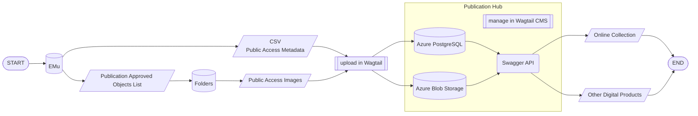
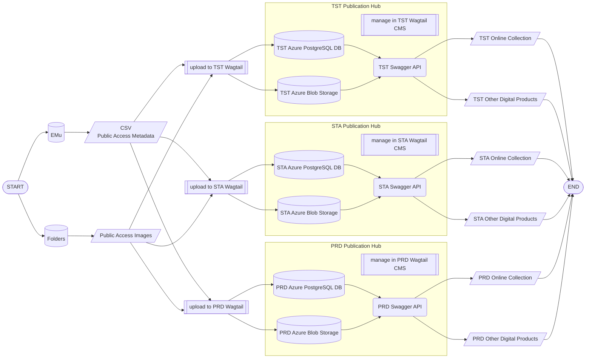
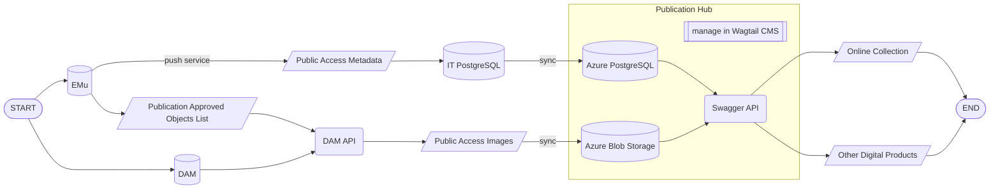

# OC EMu to Online Workflow, manual and automated

## MANUAL

```mermaid
flowchart LR

START([START]) --> EMu

Folders[(Folders)] --> Images

EMu[(EMu)] --> Metadata[/CSV 
Public Access Metadata/]

EMu --> Objects[/Publication Approved Objects List/]
Objects[/Publication Approved Objects List/] --> Folders

Metadata --> Wagtail[[upload in Wagtail]]

Images[/Public Access Images/] --> Wagtail


subgraph Publication Hub

CMS[[manage in Wagtail CMS]]

DB[(Azure PostgreSQL)]
Storage[(Azure Blob Storage)]
API(Swagger API)

end

Wagtail --> DB[(Azure PostgreSQL)]

Wagtail --> Storage[(Azure Blob Storage)]

DB --> API

Storage --> API

API(Swagger API)

API --> OC[/Online Collection/]
API --> ODP[/Other Digital Products/]

OC --> END
ODP --> END

END([END])

```

## MANUAL WITH Test, Staging and Production

```mermaid
flowchart LR

START([START])

EMu[(EMu)] --> Metadata[/CSV 
Public Access Metadata/]

START --> EMu
START --> Folders[(Folders)] --> Images

TSTWagtail[[upload to TST Wagtail]]

Metadata --> TSTWagtail
Images[/Public Access Images/] --> TSTWagtail

subgraph TST Publication Hub

TSTCMS[[manage in TST Wagtail CMS]]

TSTDB[(TST Azure PostgreSQL DB)]
TSTStorage[(TST Azure Blob Storage)]
TSTAPI(Swagger API)

end

TSTWagtail --> TSTDB
TSTWagtail --> TSTStorage

TSTDB --> TSTAPI

TSTStorage --> TSTAPI

TSTAPI(TST Swagger API)

TSTAPI --> TSTOC[/TST Online Collection/]
TSTAPI --> TSTODP[/TST Other Digital Products/]

TSTOC --> END
TSTODP --> END

END([END])


STAWagtail[[upload to STA Wagtail]]

Metadata --> STAWagtail
Images[/Public Access Images/] --> STAWagtail

subgraph STA Publication Hub

STACMS[[manage in STA Wagtail CMS]]

STADB[(STA Azure PostgreSQL DB)]
STAStorage[(STA Azure Blob Storage)]
STAAPI(Swagger API)

end

STAWagtail --> STADB
STAWagtail --> STAStorage

STADB --> STAAPI

STAStorage --> STAAPI

STAAPI(STA Swagger API)

STAAPI --> STAOC[/STA Online Collection/]
STAAPI --> STAODP[/STA Other Digital Products/]

STAOC --> END
STAODP --> END


PRDWagtail[[upload to PRD Wagtail]]

Metadata --> PRDWagtail
Images[/Public Access Images/] --> PRDWagtail

subgraph PRD Publication Hub

PRDCMS[[manage in PRD Wagtail CMS]]

PRDDB[(PRD Azure PostgreSQL DB)]
PRDStorage[(PRD Azure Blob Storage)]
PRDAPI(Swagger API)

end

PRDWagtail --> PRDDB
PRDWagtail --> PRDStorage

PRDDB --> PRDAPI

PRDStorage --> PRDAPI

PRDAPI(PRD Swagger API)

PRDAPI --> PRDOC[/PRD Online Collection/]
PRDAPI --> PRDODP[/PRD Other Digital Products/]

PRDOC --> END
PRDODP --> END

```

## AUTOMATED

```mermaid
flowchart LR

START([START])

START --> EMu[(EMu)]
START --> DAM[(DAM)] --> DAMAPI(DAM API)

EMu -->|push service| Data[/Public Access Metadata/]
EMu --> Objects[/Publication Approved Objects List/]
Objects[/Publication Approved Objects List/] --> DAMAPI

DAMAPI --> Images[/Public Access Images/]

Data --> ITEMu[(IT PostgreSQL)]

subgraph Publication Hub

CMS[[manage in Wagtail CMS]]

DB[(Azure PostgreSQL)]
Storage[(Azure Blob Storage)]
API(Swagger API)

end

ITEMu -->|sync| DB

Images -->|sync| Storage

DB --> API

Storage --> API


API --> OC[/Online Collection/]
API --> ODP[/Other Digital Products/]

OC --> END
ODP --> END

END([END])

```
