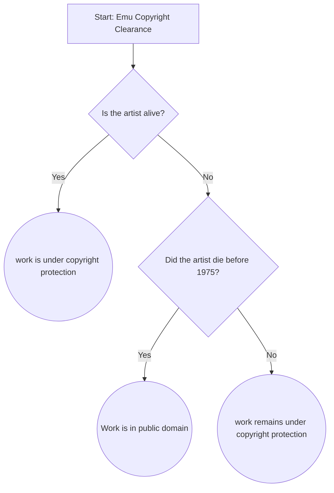

```mermaid
flowchart TD
    A[Start: Emu Copyright Clearance] --> B{Is the artist alive?}
    B -->|Yes| C((work is under copyright protection))
    B -->|No| D{Did the artist die before 1975?}
    D -->|Yes| E((Work is in public domain))
    D -->|No| F((work remains under copyright protection))
    

```
