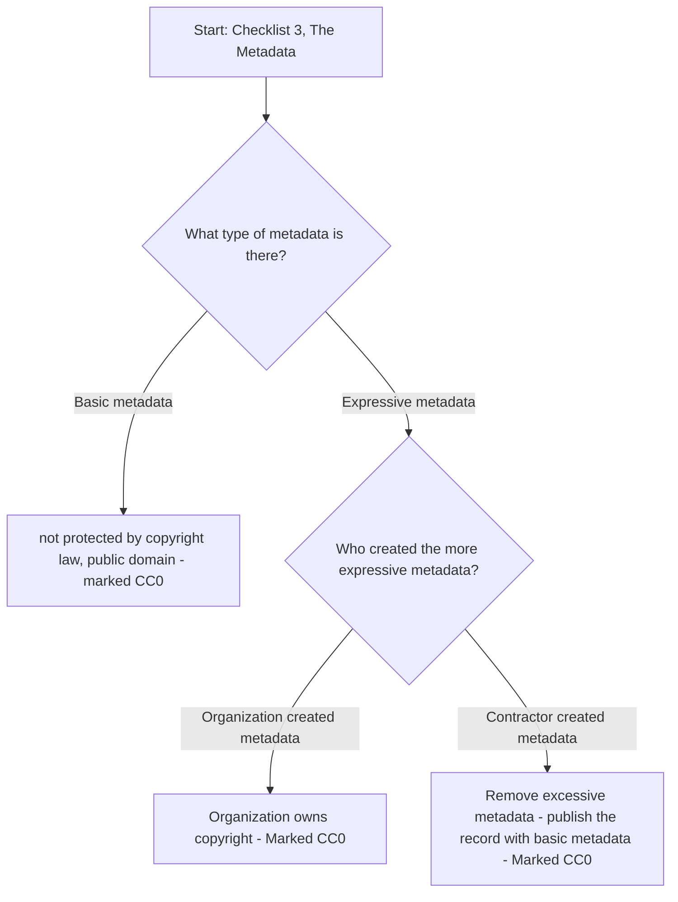

```mermaid
flowchart TD
    A[Start: Checklist 3, The Metadata] --> B{What type of metadata is there?}
    B -->|Basic metadata| C[not protected by copyright law, public domain - marked CC0]
    B -->|Expressive metadata| D{Who created the more expressive metadata?}
    D -->|Organization created metadata| E[Organization owns copyright - Marked CC0]
    D -->|Contractor created metadata| F[Remove excessive metadata - publish the record with basic metadata - Marked CC0]
```
