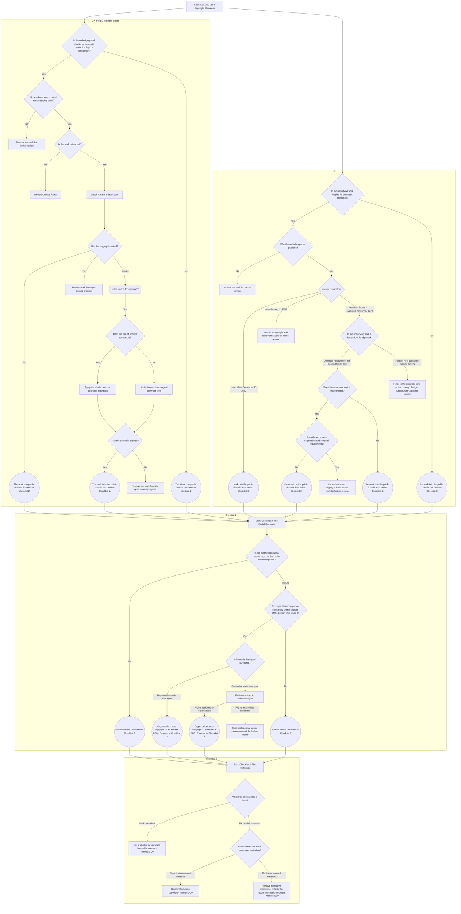

```mermaid
flowchart TD
    A[Start: GLAM-E Lab's Copyright Clearance] --> B{Is the underlying work eligible for copyright protection in your jurisdiction?}
    A --> 1{Is the underlying work eligible for copyright protection?}

    subgraph US 
    1 -->|Yes| 2{Was the underlying work published}
    1 --> |No| 3((the work is in the public domain. Proceed to Checklist 2))
    2 --> |No| 4[ remove the work for further review]
    2 --> |Yes| 5{date of publication}
    5 -->|on or before December 31, 1930| 6((work is in the public domain. Proceed to Checklist 2.))
    5 --> |after January 1, 1978| 7[work is in-copyright and remove the work for further review.]
    5 --> |between January 1, 1928,and January 1, 1978| 8{Is the underlying work a domestic or foreign work?}
    8 --> |Domestic Published in the US or within 30 days| 9{Does the work meet notice requirements?}
    8 --> |Foreign First published outside the US| 10[Refer to the copyright laws of the country of origin. Seek further advice if unsure]
    9 --> |Yes| 11{Does the work meet registration and renewal requirements?}
    9 --> |No| 12((the work is in the public domain. Proceed to Checklist 2.))
    11 -->|No| 14((the work is in the public domain. Proceed to Checklist 2.))
    11 -->|Yes| 15[the work is under copyright. Remove the work for further review.]
    end

    subgraph UK and EU Member States 
    B --Yes--> C{Do you know who created the underlying work?}
    B -- No -->D((The Work is in public domain. Proceed to checklist 2))
    C -->|No| E[Remove the work for further review]
    C --> |Yes| F{Is the work published?}
    F --> |No| G[Review Country Rules]
    F --> |Yes| H[Check Creator's death date]
    H --> I{Has the copyright expired?}
    I --> |Yes| J((The work is in public doman. Proceed to checklist 2))
    I -->|No| K[Remove work from open access program]
    I --> |Unsure| L(Is the work a foreign work?)
    L --> |Yes| M{Does the rule of shorter term apply?}
    M --> |Yes| N[Apply the shorter term for copyright expiration] 
    M --> |No| O[Apply the country’s original copyright term]
    O --> P{Has the copyright expired?}
    N --> P
    P --> |Yes| Q((The work is in the public domain. Proceed to Checklist 2.))
    P --> |No| R[Remove the work from the open access program.]
    end

    subgraph Checklist 2
    3 --> A2
    6 --> A2
    12 --> A2
    14 --> A2
    J --> A2
    D --> A2
    Q --> A2
    A2[Start: Checklist 2, The Digital Surrogate] --> B2{Is the digital surrogate a faithful reproduction of the underlying work?}
    B2 -->|Yes| C2((Public Domain - Proceed to Checklist 3))
    B2 -->|unsure| D2{Did digitization incorporate sufficiently create choices of the person who made it?}
    
    D2 -->|Yes| E2{Who made the digital surrogate?}
    D2 -->|No| F2((Public Domain - Proceed to Checklist 3))
    
    E2 -->|Organization made surrogate| G2((Organization owns copyright - Can release CC0 - Proceed to Checklist 3))
    E2 -->|Contractor made surrogate| H2[Review contract to determine rights]

    H2 -->|Rights assigned to organization| I2((Organization owns copyright - Can release CC0 - Proceed to Checklist 3))
    H2 -->|Rights retained by contractor| J2[Seek professional advice or remove work for further review]
    end

    
    subgraph Checklist 3
    C2 --> A3
    F2 --> A3
    G2 --> A3
    I2 --> A3
    A3[Start: Checklist 3, The Metadata] --> B3{What type of metadata is there?}
    B3 -->|Basic metadata| C3[not protected by copyright law, public domain - marked CC0]
    B3 -->|Expressive metadata| D3{Who created the more expressive metadata?}
    D3 -->|Organization created metadata| E3[Organization owns copyright - Marked CC0]
    D3 -->|Contractor created metadata| F3[Remove excessive metadata - publish the record with basic metadata - Marked CC0]
    end
```
